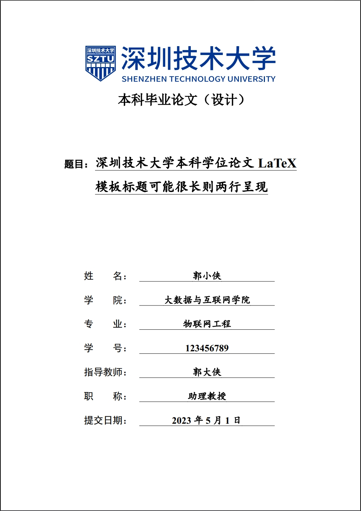

# 深圳技术大学学位论文 LaTeX 模板

这是一个面向深圳技术大学本科毕业论文（设计）的 LaTeX 模板仓库，提供论文主文件、内容拆分结构、参考文献样式，以及基础编译脚本。

仓库内已包含示例内容与编译产物，适合直接克隆后修改 `content/` 下的文件开始写作。



## 快速开始

主入口文件是 `sztuthesis_main.tex`。

常用命令：

```bash
# 单次编译
make

# 持续监听并自动编译
make pvc

# 清理辅助文件
make clean
make cleanall
```

如果你不用 `make`，至少需要保证编译链为：

```bash
xelatex -> bibtex -> xelatex -> xelatex
```

## 你通常需要改哪些文件

- `content/info.tex`：封面信息、作者、导师、日期、盲审开关
- `content/abstractcn.tex`：中文摘要与关键词
- `content/abstracten.tex`：英文摘要与关键词
- `content/content.tex`：正文
- `content/additional.tex`：致谢、附录、成果说明等
- `thesis-references.bib`：参考文献条目

## 仓库结构

- `sztuthesis_main.tex`：论文主入口，负责按顺序组织整篇文档
- `content/`：论文正文与摘要等内容文件
- `images/`：图片资源目录
- `SZTUthesis.cls`：模板样式文件，控制版式、字体、标题、页眉页脚等
- `thesis-references.bib`：BibTeX 参考文献数据库
- `official_documents/`：学校相关参考文档

## 重要文件

### `Makefile`

项目默认编译入口，封装了最常用的构建命令：

- `make`：生成论文 PDF
- `make pvc`：监听文件变化并自动重编译
- `make clean` / `make cleanall`：清理辅助文件
- `make wordcount`：统计中文字数和总字数

如果你只是想正常写论文，优先使用它。

### `tutorial.md`

快速上手文档，面向第一次使用这个模板的人。内容包括：

- 应该先改哪些文件
- 日常最常用的编译命令
- 封面、摘要、正文、致谢、参考文献的修改位置
- 常见 LaTeX 用法示例

如果你想尽快开始写论文，先看这个文件。

### `architecture.md`

模板结构说明，面向想理解模板职责分层、扩展章节结构或修改样式的人。内容包括：

- 主文件、内容文件、类文件之间的分工
- 改内容时应该去哪里改
- 改版式时应该去哪里改
- 后续维护模板时应优先查看哪些文件

如果你要维护模板，或者让 agent 帮你改模板，先看这个文件。

### `texclear.sh`

一个独立的 TeX 辅助文件清理脚本，会删除常见编译中间文件。

通常优先使用 `make clean` 或 `make cleanall` 即可；当你不走 `Makefile` 流程，或者想单独手动清理辅助文件时，可以使用它。

## 进一步阅读

- 详细上手说明见 [tutorial.md](tutorial.md)
- 模板结构与维护说明见 [architecture.md](architecture.md)

## 说明

- 仓库当前保留生成的 PDF，便于导师或同学直接审阅论文草稿
- 模板样式主要由 `SZTUthesis.cls` 控制；如果只是写论文内容，不需要先改它
